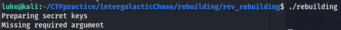
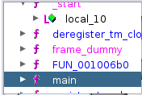
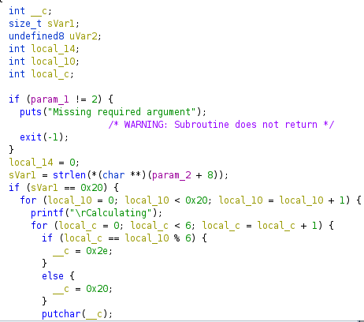
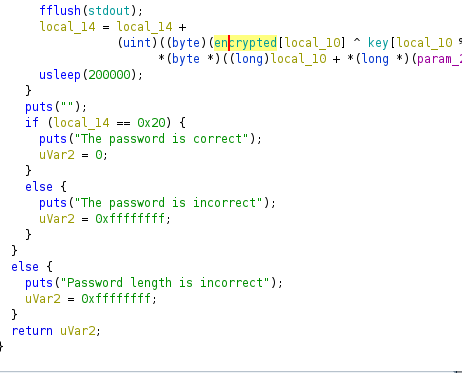
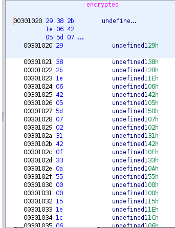
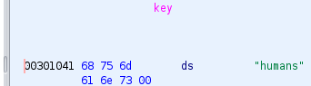
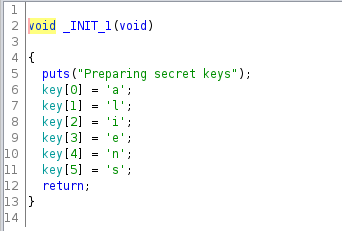

# Rebiulding (Reverse Engineering, 300p, 463 solved)

A mostly straight-forward Reverse Engineering puzzle with a twist
We are given just an [ELF File](rebuilding) to work with and explore

First things first, I run the program to get a little more information about what we are working with  
  
It looks like we need to supply it some data and it will return a key.

Having no information about what kind of infomration it needs or the format it might give out the flag in, my next step is to open the program in [Ghidra](https://ghidra-sre.org)  
Typically, it is most usful to start with the main function, so we will start there  
  

On initial inspection, we can see that the program is running a nested for loop that prints out "calculating" and either a dot or a space character any time the loop conditions are met. It is safe to assume that this section is to give a loading screen appearance during the program's operations. Further down, we find the part of the program that holds the key to the flag.  
  

The function appears to use information from two data labels "key" and "encrypted" along with what we supply the program in param_2.
The program runs a lengthy, non-standard comparison routine on the input we give it and the mathematical operation done on what it contained in key and encrypted. so the next step is to see if we can find what data is held in these two labels.  

Looking around the assembly, we can find both labels clearly denoted  
  
  

But inside of one of the constructors is another data set that uses the label "key"  
  

The data in the first two images are denoted in hex and can be converted to ascii to see if they are useful. the data in key can be decoded to "humans" and the data encrypted is not comprehensible. The interesting part of this box comes from the second data set called "key" that is a char array holding the value "aliens". 

In order to find a useable output from the key generator, I took the obfuscation code and placed a variation into my own C program to play around with.  
'''
#include <stdlib.h>

int main()
{
    int local_14;
    unsigned char encdata[] = {0x29, 0x38, 0x2B, 0x1E, 0x06, 0x42, 0x05, 0x5D, 0x07, 0x02, 0x31, 0x42, 0x0F, 0x33, 0x0A, 0x55,
    0x00, 0x00, 0x15, 0x1E, 0x1C, 0x06, 0x1A, 0x43, 0x13, 0x59, 0x36, 0x54, 0x00, 0x42, 0x15, 0x11};

    unsigned char keydata[] = {0x68, 0x75, 0x6D, 0x61, 0x6E, 0x73};

    unsigned char a = 0x38;
    unsigned char b = 0x75;

    for(int i = 0; i < 32; i++){
        local_14 = (unsigned int)(encdata[i] ^ keydata[i%6]);
        /*printf("Encdata: %d || keydata: %d || combined: %d\n", encdata[i], keydata[i], local_14);*/
        printf("%c", local_14);
    }

    printf("%c", local_14);

    return 0;
}
'''
Running this code using the hex values that make up "humans" produces an incomprehensible value  
[Figure 8](fakeflag.png)  

Running it again with the hex for "aliens" returns what is almost certainly the flag  
[Figure 9](flag.png)  

If we want to be certain about whether or not the flag is correct, we can use it as the input to the program.  
[Figure 10](proofofcompletion.png)  

Altogether a fun box with a small twist in where to find the required key.
