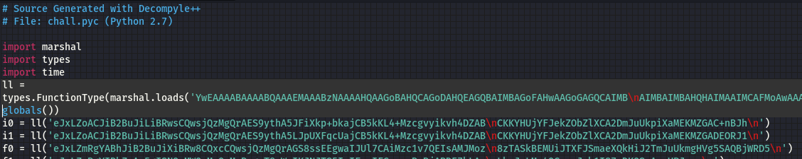

# SnakeCode (Reverse Engineering, 300p, 475 solves)

A mid-range difficulty python problem using Byte-code

We are given a [compiled python file (pyc)](chall.pyc) and tasked with finding the flag
Using the "file" command in linux, we are able to see that the pyc file is using Python2.7  

Next, I'd like to see what the program does when run, and to no suprise it loads up a game of snake. The berries change between being a '#' and being letters. I am suspicious that the letters will be the flag, but there is not enough space on the snake gameboard to play until all the letters are revealed  

In order to get an approximation of the orignial python code compiled into the pyc, I can use the tool [Decompyle++](https://gist.github.com/dpogue/1231382) which turns bytecode into human-readable python. Running chall.pyc through Decomplye returns a program wuth a number of variables with unhelpful names and encoding along with a single function at the bottom that calls these variables and their contents to run the game.  
  
  

The function "ll" shows that the data is serialized. In order to see what "ll" actually does we will need to undo the serialization, at least partially. We can first see all the code objects in the program decoding and loading the compiled functions.
  

Using the loads function in the marshal repetoire gives us insight into the ll function.  

Now we can see that the fucnction is using zlib, base64 encoding, and marshalling. We can reverse these processes using zlib.decompress, decode, and marshal.loads. Doing so shows us all of the code objects for the other functions in the program. And then, using the dis module in python to disassemble the result we can see more readable versions of each code object  
  

While this is cool becuase it shows us how the program handles key presses and runs the game, the flag is also contained as the character set the game pulls from to show letters as berries in the snake game  
  

This was a fun challenge for me that taught me a lot about python, byte code, and serialization.
