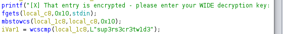

# WIDE (Reverse Engineering, 300p, 1473 solved)

An easy reverse engineering challenge 
We are given a [64 bit ELF file](wide) and 

Doing a little bit of digging on the ELF file with the "File" command in Kali, we see that it is non-stripped which will be helpful for dissecting it.

Looking into the second file given to us shows that the different response messages for trying to move around in the program are held in the .ex file

Running the program and using db.ex as the required parameter shows you a directory with a couple of options. One of them is apparently encrypted and will therefore be the center of attention

My next step to to load the program into Ghidra and try to see how the "admin secret power" section of the directory is locked up.
Ghidra is very helpful utility with a myriad of different functions. In this case, I will use the debugger window to see the program flow in C code representation.

Becuase the file is not stripped, we can easily find the main function and find where the encryption notice and checks are being implemented

It looks like the program is using wcscmp, or wide-character string compare to see if a pass phrase matches a hardcoded value: sup3rs3cr3tw1d3

Passing the phrase being checked against into the program reveals the flag

